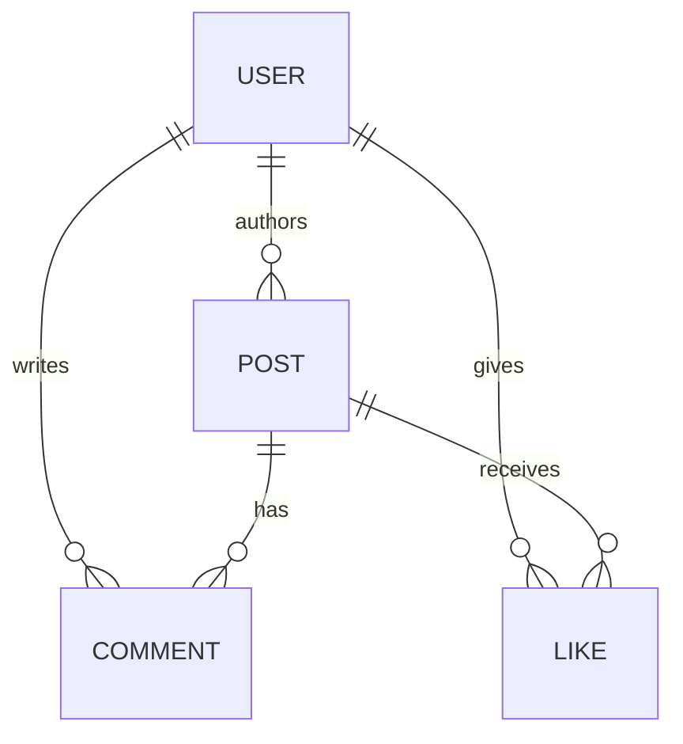

# Database Models

The app relies on **Flask-SQLAlchemy** connected to an SQLite database. Below are the key data models and their relationships.

## Entity Relationship Summary

## Models Details

### `User`
- **Fields:** `id`, `username`, `email`, `password_hash`, `bio`, `is_admin`, `joined_at`.
- **Relationships:** `posts`, `comments`, `likes`.

### `Post`
- **Fields:** `id`, `title`, `slug`, `content`, `excerpt`, `category`, `published`, `author_id`, `created_at`.
- **Relationships:** `comments`, `likes`.
- **Properties:** Includes computed properties for `like_count`, `comment_count`, and `read_time`.

### `Comment`
- **Fields:** `id`, `content`, `author_id`, `post_id`, `created_at`.
- Connects a `User`'s thought to a specific `Post`.

### `Like`
- **Fields:** `id`, `user_id`, `post_id`.
- Acts as a pure junction table linking a `User` and `Post` with a `UniqueConstraint` on `(user_id, post_id)`.
